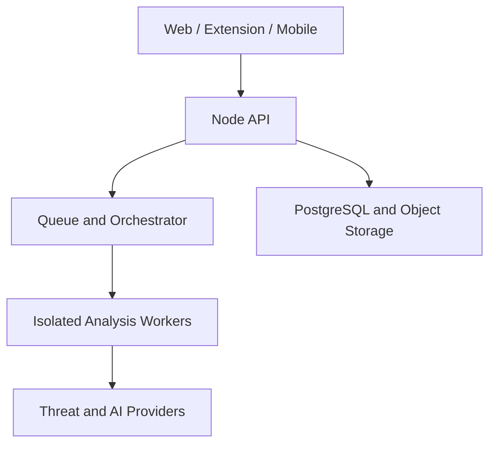

# SafePay Guardian — Complete SaaS Architecture Blueprint

Version: 1.0  
Target: Global consumer market  
Primary use case: Protect individuals and families before they trust, click, share sensitive information, or pay  
Recommended stack: React/Next.js, Node.js, PostgreSQL, Redis, object storage, threat-intelligence APIs, AI API

---

## 1. Product Definition

SafePay Guardian is a consumer safety platform that analyzes suspicious messages, links, screenshots, QR codes, listings, payment requests, and complete conversations. It provides evidence-based risk guidance, safe verification steps, family review, and post-scam recovery assistance.

The product must not claim that it can prove a person is a criminal. It should report observable risk:

- High Risk
- Suspicious
- Unable to Verify
- No Known Threat Detected

The safest product promise is:

> SafePay helps you slow down, verify independently, and make a safer decision before you pay.

### Core product difference

Many scam checkers analyze one message or URL. SafePay should focus on the complete transaction journey:

1. Listing or initial contact
2. Conversation over time
3. Identity claims
4. Payment request
5. Family review
6. Proceed, verify, or stop
7. Recovery assistance if payment was already made

---

## 2. Initial Target Market

Do not initially target every scam type and every country.

### Recommended first customer segment

English-speaking online marketplace buyers and their families in:

- United States
- United Kingdom
- Canada
- Australia

### Initial supported scam categories

- Marketplace seller scams
- Fake online-shop scams
- Delivery/courier phishing
- Bank impersonation
- Job-offer scams
- Investment and crypto scams
- Family-emergency scams
- Subscription/refund scams

### Initial supported inputs

- Plain text
- URL
- Screenshot/image
- QR-code image
- PDF

Voice calls, bank integrations, automatic payment blocking, and deepfake detection belong in later phases.

---

## 3. Product Boundaries

### SafePay will do

- Detect technical and behavioral warning signals
- Explain evidence in simple language
- Recommend independent verification
- Provide verified official contact links where available
- Let users ask a trusted family member to review a case
- Maintain a timeline of an ongoing suspicious conversation
- Guide users through recovery and official reporting
- Allow community reports with moderation and an appeal process

### SafePay will not do

- Guarantee that a transaction is safe
- Publicly declare a person a criminal based on one report
- Collect an OTP, PIN, full card number, bank password, seed phrase, or private key
- Transfer money or block a transaction without an authorized institutional integration
- Perform covert call recording
- Provide legal conclusions or promise recovery of lost money
- Let AI alone determine the verdict

---

## 4. Main User Roles

### Guest

- Run a limited text or URL scan
- View a basic result
- Read safety education
- Create an account to save a case

### Registered User

- Run all supported scans
- Create and manage cases
- Upload screenshots and PDFs
- View case timelines
- Start recovery workflows
- Submit reports

### Premium User

- Higher or unlimited scan quota
- Complete-conversation analysis
- Advanced evidence report
- Scan history
- Recovery workflows
- Priority analysis

### Family Admin

- Create a family circle
- Invite family members
- Configure review rules
- Receive high-risk alerts
- Review shared cases

### Family Member

- Run personal scans
- Share a case with the family
- Request help before paying

### Moderator

- Review community reports
- Merge duplicate indicators
- Redact personal information
- Handle appeals
- Suspend abusive reporters

### System Administrator

- Manage users and plans
- Configure provider status
- Configure rules and thresholds
- Review audit events
- Monitor queues, costs, errors, and abuse

---

## 5. Core User Journeys

### Journey A: Quick text or link check

1. User opens the homepage.
2. User pastes a message or URL.
3. The system detects the input type.
4. The system removes or masks obvious sensitive information.
5. Deterministic checks and external threat checks run.
6. AI analyzes context and manipulation patterns.
7. The evidence aggregator creates a verdict.
8. User sees risk, evidence, and recommended next steps.
9. User may save the scan as a case or share it with family.

### Journey B: Marketplace Safe Case

1. User creates a case named `Used iPhone purchase`.
2. User adds the listing link and seller conversation screenshots.
3. SafePay creates an initial risk assessment.
4. User adds new evidence when the seller asks for payment.
5. SafePay displays how risk changed over time.
6. If risk is high, SafePay recommends stopping or verifying through an official channel.
7. User requests a family review.
8. The family reviewer approves, questions, or recommends stopping.

### Journey C: QR-code check

1. User uploads a QR image.
2. SafePay decodes it without opening it in the user's browser.
3. The URL is normalized and checked in an isolated service.
4. User sees the final destination and associated risks.

### Journey D: User already paid

1. User clicks `I already paid`.
2. User selects country, payment method, payment time, and scam type.
3. SafePay generates a prioritized recovery checklist.
4. The system provides official reporting and provider contact information.
5. User records completed actions and reference numbers.
6. SafePay reminds the user to follow up.

---

## 6. Information Architecture and Pages

### Public pages

- `/` — Landing page and quick scan
- `/check` — Full scanner
- `/result/[publicId]` — Privacy-safe result
- `/how-it-works`
- `/scams`
- `/scams/[category]`
- `/countries/[country]/report-scam`
- `/pricing`
- `/security`
- `/privacy`
- `/terms`
- `/contact`

### Authenticated application

- `/app` — Safety dashboard
- `/app/check`
- `/app/scans`
- `/app/scans/[scanId]`
- `/app/cases`
- `/app/cases/new`
- `/app/cases/[caseId]`
- `/app/family`
- `/app/family/reviews`
- `/app/recovery`
- `/app/recovery/[recoveryId]`
- `/app/reports`
- `/app/notifications`
- `/app/settings/profile`
- `/app/settings/privacy`
- `/app/settings/security`
- `/app/settings/billing`

### Administration

- `/admin`
- `/admin/reports`
- `/admin/reports/[reportId]`
- `/admin/appeals`
- `/admin/rules`
- `/admin/providers`
- `/admin/users`
- `/admin/audit`
- `/admin/system`

---

## 7. UI/UX Direction

The UI must communicate calm confidence. Avoid a frightening, aggressive, hacker-style design.

### Visual principles

- Generous white space
- Large, readable typography
- Clear evidence hierarchy
- Accessible contrast
- Minimal technical language
- Mobile-first design
- One primary action per screen
- Never use color as the only risk indicator

### Suggested color system

- Brand navy: `#14213D`
- Trust blue: `#2563EB`
- Low-risk green: `#16803C`
- Caution amber: `#B45309`
- High-risk red: `#C62828`
- Neutral background: `#F7F9FC`
- Primary text: `#111827`
- Secondary text: `#4B5563`

### Risk components

Every risk result should contain:

1. Risk label
2. Plain-language summary
3. Evidence list
4. Confidence/coverage note
5. Recommended actions
6. Independent verification option
7. Family review option
8. `I already paid` recovery option

Do not display a precise score such as `92% scam` unless the score is validated. During MVP, a tier plus evidence is safer than a false sense of mathematical certainty.

### Important reusable UI components

- UniversalScanBox
- InputTypeTabs
- UploadDropzone
- ScanProgress
- RiskBadge
- VerdictCard
- EvidenceList
- EvidenceItem
- SafetyActionList
- OfficialContactCard
- CaseTimeline
- RiskTrend
- FamilyReviewCard
- RecoveryChecklist
- SensitiveDataWarning
- CommunityReportDialog
- EmptyState
- ErrorState
- ProviderStatusBanner

---

## 8. High-Level Technical Architecture



### Web application

- Renders marketing and application UI
- Performs safe client-side validation
- Uses presigned URLs for direct uploads
- Never contains private provider keys

### API service

- Authentication and authorization
- Request validation
- Rate limiting
- Case and scan orchestration
- Billing and quota checks
- Audit logging
- Presigned upload generation
- Result delivery

### Queue

Analysis should be asynchronous because URL, image, file, OCR, and AI checks can take different amounts of time.

Recommended queues:

- `scan-intake`
- `text-analysis`
- `url-analysis`
- `image-analysis`
- `file-analysis`
- `verdict-generation`
- `notifications`
- `community-moderation`
- `retention-cleanup`

### Isolated analysis workers

Workers process untrusted URLs and files away from the main API and database network.

### Provider adapters

Every external provider must sit behind an adapter. This makes it possible to change provider without rewriting business logic.

---

## 9. Recommended Monorepo Structure

Use `pnpm` workspaces and Turborepo.

```text
safepay-guardian/
├── apps/
│   ├── web/
│   ├── api/
│   └── worker/
├── packages/
│   ├── config/
│   ├── database/
│   ├── shared/
│   ├── ui/
│   ├── validation/
│   └── security-rules/
├── infrastructure/
│   ├── docker/
│   ├── nginx/
│   └── terraform/
├── docs/
├── scripts/
├── tests/
├── .github/
├── .env.example
├── docker-compose.yml
├── eslint.config.js
├── package.json
├── pnpm-lock.yaml
├── pnpm-workspace.yaml
├── prettier.config.js
├── README.md
└── turbo.json
```

TypeScript is strongly recommended even if the current skill set is JavaScript. A safety platform has complex evidence, permission, and state models; TypeScript prevents many avoidable errors. The React and Node.js concepts remain the same.

---

## 10. Complete Frontend File Structure

```text
apps/web/
├── public/
│   ├── icons/
│   │   ├── icon-192.png
│   │   ├── icon-512.png
│   │   └── maskable-icon.png
│   ├── images/
│   │   ├── hero-protection.webp
│   │   ├── family-safety.webp
│   │   └── scam-examples.webp
│   ├── favicon.ico
│   ├── manifest.webmanifest
│   └── robots.txt
├── src/
│   ├── app/
│   │   ├── (marketing)/
│   │   │   ├── page.tsx
│   │   │   ├── how-it-works/page.tsx
│   │   │   ├── pricing/page.tsx
│   │   │   ├── security/page.tsx
│   │   │   ├── contact/page.tsx
│   │   │   ├── scams/page.tsx
│   │   │   ├── scams/[category]/page.tsx
│   │   │   └── countries/[country]/report-scam/page.tsx
│   │   ├── (auth)/
│   │   │   ├── login/page.tsx
│   │   │   ├── register/page.tsx
│   │   │   ├── forgot-password/page.tsx
│   │   │   └── verify-email/page.tsx
│   │   ├── app/
│   │   │   ├── layout.tsx
│   │   │   ├── page.tsx
│   │   │   ├── check/page.tsx
│   │   │   ├── scans/page.tsx
│   │   │   ├── scans/[scanId]/page.tsx
│   │   │   ├── cases/page.tsx
│   │   │   ├── cases/new/page.tsx
│   │   │   ├── cases/[caseId]/page.tsx
│   │   │   ├── family/page.tsx
│   │   │   ├── family/reviews/page.tsx
│   │   │   ├── recovery/page.tsx
│   │   │   ├── recovery/[recoveryId]/page.tsx
│   │   │   ├── reports/page.tsx
│   │   │   ├── notifications/page.tsx
│   │   │   └── settings/
│   │   │       ├── profile/page.tsx
│   │   │       ├── privacy/page.tsx
│   │   │       ├── security/page.tsx
│   │   │       └── billing/page.tsx
│   │   ├── admin/
│   │   │   ├── layout.tsx
│   │   │   ├── page.tsx
│   │   │   ├── reports/page.tsx
│   │   │   ├── reports/[reportId]/page.tsx
│   │   │   ├── appeals/page.tsx
│   │   │   ├── rules/page.tsx
│   │   │   ├── providers/page.tsx
│   │   │   ├── users/page.tsx
│   │   │   ├── audit/page.tsx
│   │   │   └── system/page.tsx
│   │   ├── api/health/route.ts
│   │   ├── privacy/page.tsx
│   │   ├── terms/page.tsx
│   │   ├── error.tsx
│   │   ├── global-error.tsx
│   │   ├── layout.tsx
│   │   ├── loading.tsx
│   │   ├── not-found.tsx
│   │   └── sitemap.ts
│   ├── components/
│   │   ├── layout/
│   │   │   ├── AppHeader.tsx
│   │   │   ├── AppSidebar.tsx
│   │   │   ├── Footer.tsx
│   │   │   └── MobileNavigation.tsx
│   │   ├── scanner/
│   │   │   ├── UniversalScanBox.tsx
│   │   │   ├── TextInputPanel.tsx
│   │   │   ├── UrlInputPanel.tsx
│   │   │   ├── ImageInputPanel.tsx
│   │   │   ├── FileInputPanel.tsx
│   │   │   ├── UploadDropzone.tsx
│   │   │   ├── SensitiveDataWarning.tsx
│   │   │   └── ScanProgress.tsx
│   │   ├── verdict/
│   │   │   ├── VerdictCard.tsx
│   │   │   ├── RiskBadge.tsx
│   │   │   ├── EvidenceList.tsx
│   │   │   ├── EvidenceItem.tsx
│   │   │   ├── SafetyActionList.tsx
│   │   │   ├── OfficialContactCard.tsx
│   │   │   └── CoverageNotice.tsx
│   │   ├── cases/
│   │   │   ├── CaseCard.tsx
│   │   │   ├── CaseTimeline.tsx
│   │   │   ├── TimelineEvent.tsx
│   │   │   ├── RiskTrend.tsx
│   │   │   ├── AddEvidenceDialog.tsx
│   │   │   └── CaseStatusMenu.tsx
│   │   ├── family/
│   │   │   ├── FamilyMemberCard.tsx
│   │   │   ├── InviteMemberDialog.tsx
│   │   │   ├── FamilyReviewCard.tsx
│   │   │   └── ReviewDecisionForm.tsx
│   │   ├── recovery/
│   │   │   ├── RecoveryWizard.tsx
│   │   │   ├── RecoveryChecklist.tsx
│   │   │   ├── RecoveryTask.tsx
│   │   │   └── EvidenceExportButton.tsx
│   │   ├── reports/
│   │   │   ├── CommunityReportDialog.tsx
│   │   │   ├── ReportStatusBadge.tsx
│   │   │   └── AppealForm.tsx
│   │   └── common/
│   │       ├── Button.tsx
│   │       ├── Card.tsx
│   │       ├── Dialog.tsx
│   │       ├── EmptyState.tsx
│   │       ├── ErrorState.tsx
│   │       ├── Pagination.tsx
│   │       ├── ProviderStatusBanner.tsx
│   │       └── Skeleton.tsx
│   ├── hooks/
│   │   ├── useAuth.ts
│   │   ├── useCases.ts
│   │   ├── useFamily.ts
│   │   ├── useFileUpload.ts
│   │   ├── useScan.ts
│   │   └── useScanStatus.ts
│   ├── lib/
│   │   ├── api-client.ts
│   │   ├── auth-client.ts
│   │   ├── query-client.ts
│   │   ├── analytics.ts
│   │   ├── constants.ts
│   │   ├── formatters.ts
│   │   └── validators.ts
│   ├── providers/
│   │   ├── AuthProvider.tsx
│   │   ├── QueryProvider.tsx
│   │   └── ThemeProvider.tsx
│   ├── store/
│   │   ├── scanner-store.ts
│   │   └── ui-store.ts
│   ├── styles/globals.css
│   ├── types/api.ts
│   ├── types/domain.ts
│   ├── middleware.ts
│   └── instrumentation.ts
├── .env.example
├── next.config.js
├── package.json
└── tsconfig.json
```

---

## 11. Complete Backend File Structure

The API uses Express with modules and service boundaries. NestJS is also valid, but this structure is easier for an existing Node.js developer to understand.

```text
apps/api/
├── src/
│   ├── config/
│   │   ├── env.ts
│   │   ├── logger.ts
│   │   ├── providers.ts
│   │   └── security.ts
│   ├── middleware/
│   │   ├── authenticate.ts
│   │   ├── authorize.ts
│   │   ├── error-handler.ts
│   │   ├── rate-limit.ts
│   │   ├── request-id.ts
│   │   ├── security-headers.ts
│   │   └── validate-request.ts
│   ├── modules/
│   │   ├── auth/
│   │   │   ├── auth.controller.ts
│   │   │   ├── auth.routes.ts
│   │   │   ├── auth.service.ts
│   │   │   └── auth.schema.ts
│   │   ├── users/
│   │   │   ├── users.controller.ts
│   │   │   ├── users.repository.ts
│   │   │   ├── users.routes.ts
│   │   │   ├── users.service.ts
│   │   │   └── users.schema.ts
│   │   ├── scans/
│   │   │   ├── scans.controller.ts
│   │   │   ├── scans.repository.ts
│   │   │   ├── scans.routes.ts
│   │   │   ├── scans.service.ts
│   │   │   └── scans.schema.ts
│   │   ├── cases/
│   │   │   ├── cases.controller.ts
│   │   │   ├── cases.repository.ts
│   │   │   ├── cases.routes.ts
│   │   │   ├── cases.service.ts
│   │   │   └── cases.schema.ts
│   │   ├── artifacts/
│   │   │   ├── artifacts.controller.ts
│   │   │   ├── artifacts.repository.ts
│   │   │   ├── artifacts.routes.ts
│   │   │   ├── artifacts.service.ts
│   │   │   └── artifacts.schema.ts
│   │   ├── verdicts/
│   │   │   ├── verdicts.controller.ts
│   │   │   ├── verdicts.repository.ts
│   │   │   ├── verdicts.routes.ts
│   │   │   └── verdicts.service.ts
│   │   ├── family/
│   │   │   ├── family.controller.ts
│   │   │   ├── family.repository.ts
│   │   │   ├── family.routes.ts
│   │   │   ├── family.service.ts
│   │   │   └── family.schema.ts
│   │   ├── recovery/
│   │   │   ├── recovery.controller.ts
│   │   │   ├── recovery.repository.ts
│   │   │   ├── recovery.routes.ts
│   │   │   ├── recovery.service.ts
│   │   │   └── recovery.schema.ts
│   │   ├── community/
│   │   │   ├── community.controller.ts
│   │   │   ├── community.repository.ts
│   │   │   ├── community.routes.ts
│   │   │   ├── community.service.ts
│   │   │   └── community.schema.ts
│   │   ├── notifications/
│   │   │   ├── notifications.controller.ts
│   │   │   ├── notifications.repository.ts
│   │   │   ├── notifications.routes.ts
│   │   │   └── notifications.service.ts
│   │   ├── billing/
│   │   │   ├── billing.controller.ts
│   │   │   ├── billing.routes.ts
│   │   │   ├── billing.service.ts
│   │   │   └── billing.webhook.ts
│   │   ├── admin/
│   │   │   ├── admin.controller.ts
│   │   │   ├── admin.routes.ts
│   │   │   └── admin.service.ts
│   │   └── health/
│   │       ├── health.controller.ts
│   │       └── health.routes.ts
│   ├── queues/
│   │   ├── queue-client.ts
│   │   ├── queue-names.ts
│   │   └── jobs.ts
│   ├── services/
│   │   ├── audit.service.ts
│   │   ├── crypto.service.ts
│   │   ├── entitlement.service.ts
│   │   ├── redaction.service.ts
│   │   └── storage.service.ts
│   ├── utils/
│   │   ├── async-handler.ts
│   │   ├── errors.ts
│   │   ├── hashes.ts
│   │   ├── pagination.ts
│   │   └── response.ts
│   ├── app.ts
│   └── server.ts
├── tests/
│   ├── integration/
│   ├── security/
│   └── unit/
├── .env.example
├── Dockerfile
├── package.json
└── tsconfig.json
```

---

## 12. Analysis Worker File Structure

```text
apps/worker/
├── src/
│   ├── config/
│   │   ├── env.ts
│   │   └── logger.ts
│   ├── consumers/
│   │   ├── scan-intake.consumer.ts
│   │   ├── text-analysis.consumer.ts
│   │   ├── url-analysis.consumer.ts
│   │   ├── image-analysis.consumer.ts
│   │   ├── file-analysis.consumer.ts
│   │   ├── verdict-generation.consumer.ts
│   │   ├── notification.consumer.ts
│   │   └── retention-cleanup.consumer.ts
│   ├── analyzers/
│   │   ├── text/
│   │   │   ├── text-analyzer.ts
│   │   │   ├── manipulation-signals.ts
│   │   │   ├── payment-signals.ts
│   │   │   └── identity-claims.ts
│   │   ├── url/
│   │   │   ├── url-analyzer.ts
│   │   │   ├── url-normalizer.ts
│   │   │   ├── redirect-analyzer.ts
│   │   │   ├── homograph-detector.ts
│   │   │   ├── domain-analyzer.ts
│   │   │   └── ssl-analyzer.ts
│   │   ├── image/
│   │   │   ├── image-analyzer.ts
│   │   │   ├── ocr-extractor.ts
│   │   │   ├── qr-extractor.ts
│   │   │   └── metadata-stripper.ts
│   │   └── file/
│   │       ├── file-analyzer.ts
│   │       ├── mime-validator.ts
│   │       ├── pdf-extractor.ts
│   │       └── malware-scanner.ts
│   ├── orchestration/
│   │   ├── analysis-orchestrator.ts
│   │   ├── evidence-aggregator.ts
│   │   ├── risk-classifier.ts
│   │   ├── verdict-builder.ts
│   │   └── action-recommender.ts
│   ├── providers/
│   │   ├── ai/
│   │   │   ├── ai-provider.interface.ts
│   │   │   ├── openai.provider.ts
│   │   │   └── mock-ai.provider.ts
│   │   ├── threat/
│   │   │   ├── threat-provider.interface.ts
│   │   │   ├── google-web-risk.provider.ts
│   │   │   └── mock-threat.provider.ts
│   │   ├── domain/
│   │   │   ├── domain-provider.interface.ts
│   │   │   ├── rdap.provider.ts
│   │   │   └── dns.provider.ts
│   │   └── ocr/
│   │       ├── ocr-provider.interface.ts
│   │       ├── tesseract.provider.ts
│   │       └── vision-ocr.provider.ts
│   ├── security/
│   │   ├── network-policy.ts
│   │   ├── private-ip-blocker.ts
│   │   ├── safe-fetch.ts
│   │   ├── sandbox.ts
│   │   └── content-limits.ts
│   ├── services/
│   │   ├── artifact.service.ts
│   │   ├── pii-redaction.service.ts
│   │   ├── prompt.service.ts
│   │   └── result-persistence.service.ts
│   ├── prompts/
│   │   ├── system-prompt.ts
│   │   ├── text-analysis.prompt.ts
│   │   ├── conversation-analysis.prompt.ts
│   │   └── explanation.prompt.ts
│   ├── utils/
│   │   ├── retry.ts
│   │   ├── timeout.ts
│   │   └── idempotency.ts
│   └── worker.ts
├── tests/
│   ├── fixtures/
│   ├── integration/
│   └── unit/
├── Dockerfile
├── package.json
└── tsconfig.json
```

---

## 13. Shared Packages

```text
packages/database/
├── prisma/
│   ├── migrations/
│   ├── schema.prisma
│   └── seed.ts
├── src/client.ts
└── package.json

packages/security-rules/
├── src/
│   ├── categories.ts
│   ├── rule-engine.ts
│   ├── rules/
│   │   ├── urgency.rules.ts
│   │   ├── secrecy.rules.ts
│   │   ├── impersonation.rules.ts
│   │   ├── credential-request.rules.ts
│   │   ├── payment-method.rules.ts
│   │   ├── marketplace.rules.ts
│   │   └── investment.rules.ts
│   ├── thresholds.ts
│   └── types.ts
├── tests/
└── package.json

packages/shared/
├── src/
│   ├── constants.ts
│   ├── enums.ts
│   ├── events.ts
│   ├── permissions.ts
│   ├── plans.ts
│   └── types.ts
└── package.json

packages/validation/
├── src/
│   ├── artifact.schemas.ts
│   ├── case.schemas.ts
│   ├── family.schemas.ts
│   ├── scan.schemas.ts
│   └── user.schemas.ts
└── package.json

packages/ui/
├── src/
│   ├── components/
│   ├── tokens/
│   └── index.ts
└── package.json
```

---

## 14. Database Design

### `users`

- `id`
- `email`
- `display_name`
- `locale`
- `country_code`
- `role`
- `plan`
- `status`
- `created_at`
- `updated_at`

### `cases`

- `id`
- `owner_user_id`
- `title`
- `category`
- `counterparty_label`
- `status`
- `current_risk_tier`
- `created_at`
- `updated_at`
- `closed_at`

Do not require the counterparty's real name. A neutral label such as `Marketplace seller` is safer.

### `case_artifacts`

- `id`
- `case_id`
- `uploaded_by_user_id`
- `artifact_type`
- `storage_key`
- `sha256`
- `mime_type`
- `size_bytes`
- `processing_status`
- `retention_expires_at`
- `created_at`

### `scans`

- `id`
- `user_id`
- `case_id`
- `input_type`
- `status`
- `language`
- `provider_cost_usd`
- `started_at`
- `completed_at`
- `failure_code`

### `risk_signals`

- `id`
- `scan_id`
- `signal_code`
- `category`
- `severity`
- `confidence`
- `source_type`
- `source_reference`
- `human_readable_reason`
- `raw_value_encrypted`
- `created_at`

### `risk_verdicts`

- `id`
- `scan_id`
- `risk_tier`
- `confidence_tier`
- `summary`
- `limitations`
- `recommended_actions_json`
- `rules_version`
- `model_version`
- `created_at`

### `family_groups`

- `id`
- `owner_user_id`
- `name`
- `created_at`

### `family_members`

- `id`
- `family_group_id`
- `user_id`
- `relationship_label`
- `member_role`
- `status`
- `created_at`

### `family_reviews`

- `id`
- `case_id`
- `requested_by_user_id`
- `reviewer_user_id`
- `decision`
- `comment`
- `created_at`

### `community_reports`

- `id`
- `reporter_user_id`
- `indicator_type`
- `indicator_hash`
- `indicator_value_encrypted`
- `category`
- `description`
- `evidence_status`
- `moderation_status`
- `created_at`

### `appeals`

- `id`
- `community_report_id`
- `submitted_by`
- `reason`
- `status`
- `resolution`
- `created_at`
- `resolved_at`

### `recovery_plans`

- `id`
- `user_id`
- `case_id`
- `country_code`
- `payment_method`
- `incident_time`
- `status`
- `created_at`

### `recovery_tasks`

- `id`
- `recovery_plan_id`
- `title`
- `priority`
- `official_url`
- `status`
- `reference_number_encrypted`
- `due_at`
- `completed_at`

### `subscriptions`

- `id`
- `user_id`
- `provider`
- `provider_customer_id`
- `provider_subscription_id`
- `plan`
- `status`
- `current_period_end`

### `audit_logs`

- `id`
- `actor_user_id`
- `action`
- `resource_type`
- `resource_id`
- `request_id`
- `ip_hash`
- `metadata_json`
- `created_at`

---

## 15. API Design

Use `/v1` from the first release.

### Scans

```text
POST   /v1/scans/text
POST   /v1/scans/url
POST   /v1/scans/image
POST   /v1/scans/file
GET    /v1/scans
GET    /v1/scans/:scanId
GET    /v1/scans/:scanId/status
DELETE /v1/scans/:scanId
```

### Uploads

```text
POST   /v1/uploads/presign
POST   /v1/uploads/:artifactId/complete
DELETE /v1/uploads/:artifactId
```

### Cases

```text
POST   /v1/cases
GET    /v1/cases
GET    /v1/cases/:caseId
PATCH  /v1/cases/:caseId
DELETE /v1/cases/:caseId
POST   /v1/cases/:caseId/artifacts
GET    /v1/cases/:caseId/timeline
POST   /v1/cases/:caseId/close
```

### Family

```text
POST   /v1/family-groups
GET    /v1/family-groups/current
POST   /v1/family-groups/invitations
POST   /v1/family-groups/invitations/:token/accept
DELETE /v1/family-groups/members/:memberId
POST   /v1/cases/:caseId/reviews
GET    /v1/family-reviews
POST   /v1/family-reviews/:reviewId/decision
```

### Community reporting

```text
POST   /v1/community-reports
GET    /v1/community-reports/:reportId/status
POST   /v1/community-reports/:reportId/appeals
```

### Recovery

```text
POST   /v1/recovery-plans
GET    /v1/recovery-plans/:recoveryId
PATCH  /v1/recovery-tasks/:taskId
POST   /v1/recovery-plans/:recoveryId/export
```

### Billing

```text
GET    /v1/billing/plans
POST   /v1/billing/checkout
POST   /v1/billing/portal
POST   /v1/webhooks/billing
```

### Privacy

```text
POST   /v1/privacy/export
POST   /v1/privacy/delete-account
PATCH  /v1/privacy/retention
```

### Administration

```text
GET    /v1/admin/reports
GET    /v1/admin/reports/:reportId
POST   /v1/admin/reports/:reportId/decision
GET    /v1/admin/appeals
POST   /v1/admin/appeals/:appealId/decision
GET    /v1/admin/rules
POST   /v1/admin/rules/publish
GET    /v1/admin/providers/status
GET    /v1/admin/audit-logs
```

All mutation endpoints should support an `Idempotency-Key` header where duplicate submissions could cause problems.

---

## 16. Scam Detection Engine

### Layer 1: Input classification

Determine whether the input contains:

- Text
- URL
- QR
- Email-like content
- Phone number
- Payment request
- Identity claim
- Marketplace listing

### Layer 2: Sensitive-data redaction

Detect and mask:

- OTP
- PIN-like values
- Card numbers
- Bank account information
- Government ID numbers
- Email addresses
- Phone numbers
- Addresses
- Seed phrases/private keys

### Layer 3: Deterministic rules

Examples:

- Urgency or threat
- Secrecy request
- Guaranteed return/profit
- Payment required to receive a prize/refund/job
- Gift-card, crypto, wire, or unusual payment request
- Credential or OTP request
- Move conversation off a protected platform
- Advance payment before viewing an item
- Brand-domain mismatch

### Layer 4: Technical intelligence

- Threat-list lookup
- Domain registration information
- DNS and SSL signals
- Redirect chain
- Homograph/typosquatting detection
- File type and malware scan
- QR destination analysis

### Layer 5: Conversation behavior

- Risk escalation over time
- Inconsistent identity claims
- Change from normal conversation to urgent payment
- Repeated refusal of independent verification
- Pressure to avoid family or bank contact
- Multiple payment requests

### Layer 6: AI contextual analysis

The model should return structured JSON, not free-form prose:

```json
{
  "category": "marketplace_scam",
  "signals": [
    {
      "code": "ADVANCE_PAYMENT_PRESSURE",
      "severity": "high",
      "confidence": "medium",
      "evidence": "Seller requests a deposit before inspection"
    }
  ],
  "missing_information": [
    "No independently verified seller identity"
  ],
  "recommended_actions": [
    "Do not send a deposit",
    "Keep payment inside the marketplace"
  ]
}
```

Validate this output with a schema. Reject unexpected fields.

### Layer 7: Evidence aggregation

Hard evidence has more authority than model opinion.

Example precedence:

1. Confirmed malicious threat-list match
2. Verified official-domain mismatch
3. Multiple strong deterministic signals
4. Conversation escalation signals
5. Community reputation
6. AI contextual interpretation

### Layer 8: Verdict generation

Suggested internal tiers:

- `HIGH_RISK`
- `SUSPICIOUS`
- `UNABLE_TO_VERIFY`
- `NO_KNOWN_THREAT`

Store every contributing signal and rule version for auditability.

---

## 17. Buyer/Seller Safety Model

The platform cannot globally verify that a buyer or seller is honest without access to trusted identity and transaction systems.

Instead, use the term `counterparty risk` and examine:

- Identity consistency
- Account age where legally and technically available
- Communication behavior
- Listing duplication
- Payment request behavior
- Refusal to use platform protection
- Reputation evidence
- Known malicious links
- Community reports

Safe result language:

> We found no known technical threat, but the seller's identity could not be independently verified. Use the marketplace's protected payment and delivery process.

Unsafe result language:

> This person is definitely legitimate.

---

## 18. Security Architecture

### Network isolation

- Main API must never directly browse an untrusted URL.
- Run URL fetches inside isolated, disposable containers.
- Block loopback, private, link-local, and cloud metadata IP ranges.
- Revalidate the destination after every redirect.
- Limit redirects, DNS resolution time, total time, and response size.
- Disable JavaScript unless a specialized sandbox is required.

### File safety

- Upload directly to a quarantine bucket.
- Validate file signatures, not only file extensions.
- Strip image metadata.
- Scan files before extraction.
- Never execute uploaded content.
- Render PDFs in an isolated worker.
- Enforce size, page-count, and decompression limits.

### Application security

- HTTPS only
- Secure, HttpOnly, SameSite cookies where cookies are used
- CSRF protection
- Strict Content Security Policy
- Rate limiting per IP and account
- Bot and abuse controls
- Multi-factor authentication for moderators/admins
- Role-based access control
- Parameterized queries/ORM
- Dependency scanning
- Secret scanning
- Audit logs

### Data protection

- Encrypt sensitive columns at application level
- Encrypt object storage
- Separate public and private data
- Hash community indicators for matching
- Keep raw values encrypted and tightly restricted
- Provide configurable auto-deletion
- Avoid using customer data to train models by default
- Provide data export and account deletion

### AI-specific security

- Treat uploaded text as untrusted data, never as system instructions
- Do not let uploaded content select tools or URLs
- Use fixed provider allowlists
- Validate model output against schemas
- Remove secrets before model calls
- Record prompt/model/rules versions without storing unnecessary raw data
- Test prompt-injection attacks

---

## 19. Environment Variables

```text
# Application
NODE_ENV=
WEB_APP_URL=
API_BASE_URL=
PORT=

# Database and queue
DATABASE_URL=
REDIS_URL=

# Authentication
AUTH_JWT_ISSUER=
AUTH_JWT_AUDIENCE=
AUTH_JWT_PUBLIC_KEY=

# Storage
STORAGE_ENDPOINT=
STORAGE_REGION=
STORAGE_BUCKET_QUARANTINE=
STORAGE_BUCKET_PRIVATE=
STORAGE_ACCESS_KEY_ID=
STORAGE_SECRET_ACCESS_KEY=

# Threat intelligence
GOOGLE_WEB_RISK_API_KEY=
THREAT_PROVIDER_TIMEOUT_MS=

# AI
AI_PROVIDER=
OPENAI_API_KEY=
AI_TEXT_MODEL=
AI_VISION_MODEL=
AI_TIMEOUT_MS=
AI_MAX_COST_PER_SCAN_USD=

# Email
EMAIL_PROVIDER_API_KEY=
EMAIL_FROM=

# Billing
BILLING_SECRET_KEY=
BILLING_WEBHOOK_SECRET=

# Security
FIELD_ENCRYPTION_KEY=
UPLOAD_MAX_BYTES=
PDF_MAX_PAGES=
SCAN_RETENTION_DAYS=
ALLOWED_ORIGINS=

# Monitoring
SENTRY_DSN=
LOG_LEVEL=
```

Never expose server variables using a public frontend prefix.

---

## 20. Testing Strategy

### Unit tests

- URL normalization
- Private-IP blocking
- Homograph detection
- PII redaction
- Risk rules
- Risk-tier calculation
- Plan entitlements
- Request validation

### Integration tests

- Scan creation to completed verdict
- Provider timeout and fallback
- Upload quarantine flow
- Family invitation and review
- Community report moderation
- Billing webhook idempotency
- Account deletion

### Security tests

- SSRF attempts
- Malicious redirects
- DNS rebinding
- Oversized files
- Polyglot files
- Zip bombs
- Prompt injection
- Stored XSS in uploaded text
- SQL injection
- Broken access control/IDOR
- Rate-limit bypass
- Malicious community reporting

### Evaluation dataset

Build a versioned dataset containing:

- Confirmed scam examples
- Legitimate messages that look urgent
- Real brand messages
- Typosquatting URLs
- New legitimate businesses
- Marketplace conversations
- Multilingual examples
- Ambiguous cases

Measure separately:

- High-risk precision
- Scam recall
- False-positive rate
- `Unable to Verify` rate
- Explanation quality
- Provider latency
- Cost per scan

Do not launch automatic high-confidence labels until the test set is large enough and manually reviewed.

---

## 21. Deployment Architecture

### Development

- Web: local Next.js
- API: local Node.js
- Worker: Docker
- PostgreSQL: Docker or hosted development instance
- Redis: Docker
- MinIO: local S3-compatible storage
- Mailpit: local email testing

### Beta production

- Web: Vercel or Cloudflare
- API: container host
- Worker: separate container host with strict network policy
- Database: managed PostgreSQL
- Redis: managed Redis
- Files: private object storage
- CDN/WAF: Cloudflare
- Monitoring: Sentry plus structured logs

### Production separation

- Separate development, staging, and production accounts/projects
- Separate encryption keys
- Separate buckets
- Separate databases
- No production data in local development
- CI/CD requires tests and migrations before deployment

---

## 22. CI/CD Structure

```text
.github/
└── workflows/
    ├── ci.yml
    ├── security.yml
    ├── deploy-web.yml
    ├── deploy-api.yml
    ├── deploy-worker.yml
    └── database-migration.yml
```

### `ci.yml`

- Install with frozen lockfile
- Lint
- Type-check
- Unit tests
- Integration tests
- Build all applications

### `security.yml`

- Dependency audit
- Secret scan
- Static analysis
- Container scan
- Infrastructure scan

### Deployment rules

- Preview deployment for pull requests
- Staging deployment after merge
- Production deployment requires explicit approval
- Database migration uses a dedicated job
- Worker and API versions must remain compatible

---

## 23. Subscription and Monetization

### Free

- Limited daily text and URL checks
- Basic evidence report
- Scam education
- Limited scan history

### Individual Premium

Suggested starting price: `$3.99/month` or `$29/year`.

- More or unlimited scans subject to fair use
- Screenshot and PDF analysis
- Complete case timelines
- Recovery center
- Extended history

### Family

Suggested starting price: `$6.99/month` or `$59/year`.

- Up to six members
- Family reviews
- Elder-friendly mode
- High-risk alerts
- Shared recovery assistance

### Business API

- Starter: `$49/month`
- Growth: `$199/month`
- Business: `$499+/month`
- White-label: negotiated contract

### Recommended business sequence

1. Free public checker for acquisition
2. Family plan for consumer revenue
3. Browser extension for retention
4. Business API for higher-margin revenue
5. Bank, telecom, and marketplace partnerships

Do not sell user reports or private scan data to advertisers.

---

## 24. Cost-Control Design

- Run free deterministic rules before paid APIs.
- Cache threat-intelligence results by normalized URL hash.
- Do not resend the same unchanged artifact to AI.
- Use local OCR first and paid vision only as fallback.
- Use smaller text models for classification and larger models only for ambiguous cases.
- Enforce per-plan quotas.
- Add a maximum provider cost per scan.
- Store provider cost on each scan.
- Add circuit breakers when a provider is slow or expensive.

Suggested execution order:

1. Local validation and extraction
2. Cached result lookup
3. Deterministic rules
4. Threat API
5. AI classification
6. Larger-model escalation only if necessary

---

## 25. Development Roadmap

### Milestone 0: Validation — 2 weeks

- Interview at least 20 target users
- Collect consented scam and legitimate examples
- Build a landing page
- Offer manual review
- Validate whether users will share a case with family

Exit condition: at least 10 users return with a second case or invite a family member.

### Milestone 1: Core MVP — 6 to 10 weeks

- Authentication
- Text, URL, screenshot, QR scanning
- Rule engine
- Threat-provider integration
- AI structured analysis
- Evidence-based verdict
- Case history
- Privacy controls

Exit condition: internal evaluation meets the agreed false-positive and recall targets.

### Milestone 2: Family Beta — 4 weeks

- Family groups
- Invitations
- Review requests
- Notifications
- Elder-friendly mode
- Premium billing

Exit condition: active families repeatedly use review features.

### Milestone 3: Marketplace Safety — 4 to 8 weeks

- Listing and conversation cases
- Risk timeline
- Marketplace-specific rules
- Image/listing similarity provider if justified
- Protected-payment recommendations

### Milestone 4: Recovery and Reporting — 4 weeks

- Country-specific recovery flows
- Official contact directory
- Evidence export
- Community reports
- Moderation and appeals

### Milestone 5: Distribution

- Browser extension
- Mobile share extension
- Native applications
- Business API
- Institutional integrations

---

## 26. What to Build First

Start with one complete vertical slice:

1. User pastes a marketplace conversation and URL.
2. Backend extracts links and payment signals.
3. URL intelligence runs.
4. Rule engine runs.
5. AI returns structured context analysis.
6. Evidence aggregator produces a tier.
7. UI shows evidence and recommended actions.
8. User saves it as a case.
9. User shares the case with one family member.

Do not start with the admin dashboard, native applications, phone-call protection, or automatic bank integrations.

---

## 27. Definition of MVP Success

The MVP is successful only if it demonstrates measurable user value.

Track:

- Percentage of scans that complete successfully
- Median scan time
- Cost per scan
- Percentage of results users understand
- Confirmed false positives
- Confirmed harmful cases found
- Cases with additional evidence added later
- Family-review requests
- Weekly returning users
- Free-to-paid conversion
- Account/data deletion completion

Suggested initial technical targets:

- Text result median under 8 seconds
- URL result median under 12 seconds
- 99% of jobs reach a terminal state
- No cross-user artifact access
- Every verdict contains evidence and limitations
- Every uploaded artifact has a defined deletion date

Detection-quality targets must be set only after building and manually labeling the evaluation dataset.

---

## 28. Final Build Order Checklist

### Foundation

- [ ] Confirm initial market and scam categories
- [ ] Choose product name after trademark/domain checks
- [ ] Set up monorepo
- [ ] Configure TypeScript, linting, tests, and CI
- [ ] Create development/staging/production environments

### Data and privacy

- [ ] Complete data inventory
- [ ] Define retention periods
- [ ] Define encryption strategy
- [ ] Implement sensitive-data redaction
- [ ] Create privacy/export/deletion workflows

### Core scan

- [ ] Text input
- [ ] URL input
- [ ] Screenshot upload
- [ ] QR extraction
- [ ] URL normalization
- [ ] Threat lookup
- [ ] Domain intelligence
- [ ] Deterministic rules
- [ ] AI structured analysis
- [ ] Evidence aggregation
- [ ] Verdict UI

### Case and family

- [ ] Save scan as case
- [ ] Add evidence over time
- [ ] Timeline and risk trend
- [ ] Family invitation
- [ ] Review request and decision
- [ ] Notification system

### Operations

- [ ] Moderator tools
- [ ] Audit logs
- [ ] Provider health monitoring
- [ ] Queue dashboard
- [ ] Cost dashboard
- [ ] Abuse controls
- [ ] Backups and restore test

### Launch

- [ ] Evaluation dataset and quality report
- [ ] Security review
- [ ] Terms and privacy policy
- [ ] Incident-response plan
- [ ] Support process
- [ ] Beta feedback process
- [ ] Pricing and quotas
- [ ] Public safety education content

---

## 29. Immediate Next Steps

1. Do not code the entire platform immediately.
2. Build the first marketplace-conversation vertical slice.
3. Collect consented examples from 20–30 beta users.
4. Implement deterministic rules and one commercial URL-threat provider.
5. Add AI only for context and explanation.
6. Evaluate results manually before public launch.
7. Add family review only after the core result is understandable and reliable.
8. Add paid plans after repeated usage is demonstrated.

The long-term product is not merely a scam scanner. It is a trusted decision and recovery layer positioned between suspicious contact and irreversible user action.

---

## 30. Official Technical References

- [Google Web Risk documentation](https://cloud.google.com/security/products/web-risk)
- [Google Web Risk pricing](https://cloud.google.com/web-risk/pricing)
- [VirusTotal API documentation](https://docs.virustotal.com/reference/overview)
- [CISA phishing guidance](https://www.cisa.gov/secure-our-world/recognize-and-report-phishing)
- [FTC scam guidance](https://consumer.ftc.gov/scams)
- [FTC fraud reporting](https://reportfraud.ftc.gov/)

